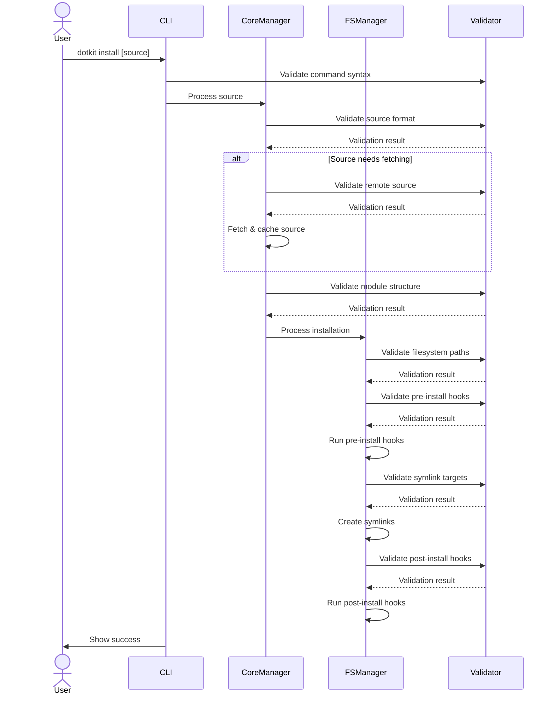
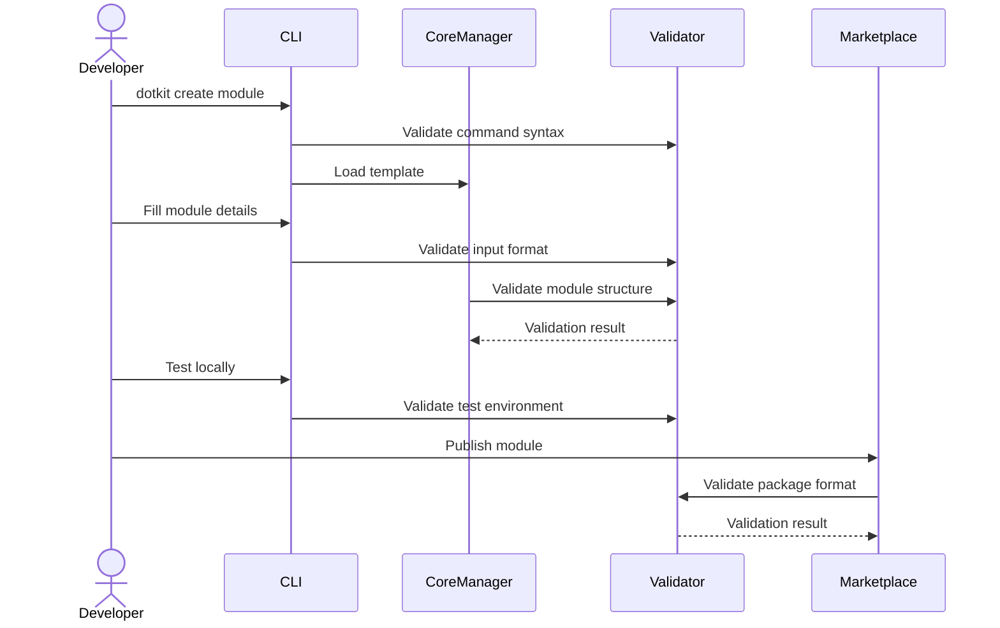
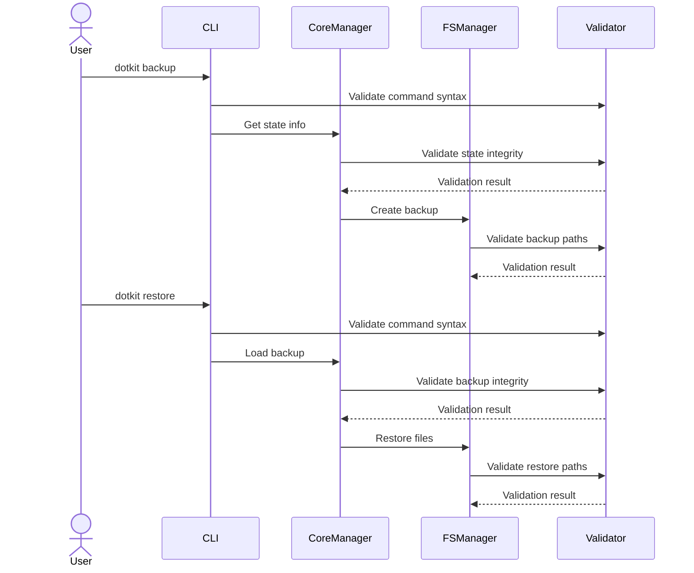

# Development Documentation

## User Journeys

### 1. Module Installation Journey



### 2. Module Creation Journey



### 3. Config Management Journey



## Cache Structure

```
~/.local/share/dotkit/
├── cache/
│   ├── git/                    # Cloned repositories
│   │   └── [repo-name]/
│   ├── modules/               # Cached modules
│   │   └── [namespace]/
│   │       └── [name]/
│   └── configs/               # Cached configurations
│       └── [namespace]/
│           └── [name]/
├── backup/                    # Backup storage
│   └── [timestamp]/
└── state/                    # Runtime state
    └── state.json
```