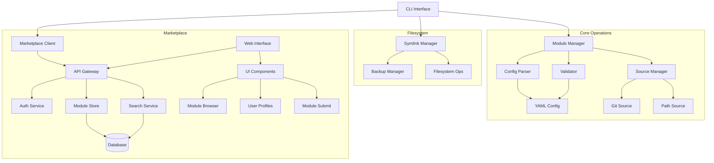

# Dotkit 🥡
[](LICENSE)
[](https://ziglang.org)
[](https://ziglang.org)

## Overview
A dotfiles configuration manager with a module based approach. The system supports multiple modules for each type of system component (bars, docks, file managers, terminals etc.) allowing for easy sharing of configurations between systems.

## Motivation

Let's be real - dotfiles are usually a beautiful mess.

Everyone does their own thing, which is awesome for making your setup uniquely yours... 
but it can be a real pain when you want to:
- Share your configs with others
- Maintain them long-term
- Try out different setups

That's why I built Dotkit.

The idea is simple: have some structure, but don't box anyone in. Want to:
- Try out someone's cool terminal setup? Just grab their module.
- Test different status bar configs? Install as many as you want.
- Switch between setups? No conflicts, no stress.

Integrate dotkit as much or as little as you want to your workflow!

## Comparison with Existing Tools

Dotkit is designed to be an *addition* to existing tools in the dotfile space like GNU Stow, Chezmoi, etc.

| Feature | Dotkit | GNU Stow | Chezmoi |
|---------|---------|----------|----------|
| Module-Based Organization | ✅ | ❌ | ❌ |
| Per-Module Versioning | ✅ | ❌ | ❌ |
| Component-Level Isolation | ✅ | ❌ | ⚠️ |
| Module Marketplace | ✅ | ❌ | ❌ |
| NixOS & Home-Manager Support | ✅ | ❌ | ❌ |

*⚠️ Partial support through templates but not component-focused*

## Core Components

### System Design


### Configuration Schema
YAML-based configuration files that define:
- Module metadata and dependencies
- File mappings and paths
- Installation hooks
- Source configurations

### Module Manager
Core operations:
- Module validation and loading
- Installation/removal
- Dependency handling
- Source management

### Symlink Manager
Filesystem operations:
- Symlink creation/removal
- Backup/restore
- Path validation
- Link monitoring

## Directory Structure

```
src/
├── main.zig                  # Application entry point
├── lib.zig                   # Re-exports public API
├── core/                     # Core functionality
│   ├── config.zig            # Re-exports config components
│   │   ├── parser.zig        # YAML config parsing
│   │   ├── schema.zig        # Config schema definitions
│   │   └── validator.zig     # Config validation
│   ├── module.zig            # Re-exports module components
│   │   ├── manager.zig       # Module lifecycle management
│   │   ├── loader.zig        # Module loading/initialization
│   │   └── validator.zig     # Module validation
│   └── source.zig            # Re-exports source components
│       ├── git.zig           # Git repository sources
│       └── path.zig          # Local filesystem sources
├── fs.zig                    # Re-exports fs components
│   ├── manager.zig           # High-level fs operations
│   ├── backup.zig            # Config backup/restore
│   └── symlink.zig           # Symlink management
├── cli.zig                   # Re-exports CLI components
│   ├── commands.zig          # CLI command implementations
│   └── output.zig            # CLI output formatting
└── utils.zig                 # Re-exports utility functions
    ├── fs.zig                # Filesystem utilities
    ├── logger.zig            # Logging functionality
    └── error.zig             # Error handling
tests/                        # Test directory
├── core/                     # Core functionality tests
│   ├── config_test.zig       # Config tests
│   ├── module_test.zig       # Module tests
│   └── source_test.zig       # Source tests
├── fs_test.zig               # Filesystem tests
├── cli_test.zig              # CLI tests
└── utils_test.zig            # Utility tests
build.zig                     # Build configuration
build.zig.zon                 # Build dependencies
```

## Implementation Details

### Module Configuration Format
Each module configuration includes:

```yaml
name: alacritty
namespace: johndoe # namespaces are used to prevent conflicts
category: terminal
description: A fast GPU-accelerated terminal emulator
# metadata only, does not install dependencies
dependencies: 
    - alacritty
    - fonts-firacode
source: 
    type: path # path, git
    location: ./alacritty
config_path: ~/.config/alacritty
files:
    - source: ./alacritty/alacritty.toml
      target: ~/.config/alacritty/alacritty.toml

    # folders can be symlinked as well
    - source: ./alacritty/scripts/**
      target: ~/.config/alacritty/scripts/
      executable: true # default is false

    # some programs have daemons that need to be started
    - source: ./alacritty/alacritty.desktop
      target: ~/.config/autostart/alacritty.desktop
hooks:
    start:
        - ./scripts/start-alacritty.sh # start the program with command or custom script
    pre_install:
        - ./scripts/install-deps.sh
        - mkdir -p ~/.config/alacritty
    post_install:
        - alacritty --version
    pre_remove:
        - ./scripts/uninstall-deps.sh
```

### Global Configuration

```yaml
name: my-dotfiles # optional name
namespace: johndoe # namespace is used to prevent conflicts
description: My personal dotfiles for hyprland

# Core paths
backup_path: ~/.local/state/dotkit/backup # default

# Global hooks, runs before any module is installed
hooks: 

modules:
    terminal:
        - source:
            type: path
            location: ./alacritty
            enable: true  # Controls if this module source is active
        - source:
            type: git # must have a config.yaml file
            url: https://github.com/my-alacritty-config.git
            branch: main  # optional
            ref: v1.0.0  # optional
            enable: false # Disabled by default
        - source:
            type: module
            config: # inline module definition
                name: alacritty
                category: terminal
                # ... rest of module config ...
```

### Example Configuration Directory

```
├── config.yaml
├── scripts/
│   └── ... 
├── alacritty/
│   ├── themes/
│   │   └── ...
│   ├── screenshots/
│   │   └── ...
│   ├── install-deps.sh
│   └── config.yaml
├── kitty/
│   ├── config.yaml
│   └── kitty.conf
└── waybar/
    ├── config.yaml
    ├── waybar.desktop
    └── waybar.conf
```

## Command Line Interface

```bash
# Core Configuration Commands
dotkit init                      # Initialize a new dotkit configuration
dotkit list                      # List available modules
dotkit status                    # Show status of all configured modules

# Module Management
dotkit install [module]          # Install all modules or a single module
dotkit remove [module]           # Remove all modules or 
dotkit backup [module]           # Backup one or all module configs
dotkit restore [module]          # Restore one or all module configs

# Source Management
dotkit pull [module]           # Update/install git-based module sources or all git based modules

# Utility Commands
dotkit eject [module]            # ejects by converting symlinks to regular files
```

## Development Phases

### Phase 1: MVP Foundation (Week 1-2)
- [ ] Basic project structure setup
- [ ] Pretty cli output utilities
- [ ] Basic CLI (install/remove/list)
- [ ] Simple YAML config parser
- [ ] Core symlink operations (create/remove)
- [ ] Essential error handling
- [ ] Unit test framework

### Phase 2: Core Features (Week 2-3)
- [ ] Module system implementation
- [ ] Config file validation
- [ ] Backup/restore functionality
- [ ] Integration tests

### Phase 3: NixOS Integration (Week 3-4)
- [ ] Home-Manager module
- [ ] NixOS module
- [ ] Nix flake integration
- [ ] Integration tests for Nix features

### Phase 4: Initial Content Creation (Week 4-5)
- [ ] Convert popular dotfile repositories to dotkit format
- [ ] Create documentation and examples for each converted module
- [ ] Establish module metadata standards and tagging system
- [ ] Quality assurance process for converted modules
- [ ] Create automated conversion tools where possible

### Phase 5: Marketplace Website (Week 5-6)
- [ ] Module marketplace frontend with search and filtering
- [ ] Module submission and review system
- [ ] User accounts and ratings
- [ ] Config sharing platform
- [ ] Module dependency visualization
- [ ] API endpoints for module/config discovery

### Phase 6: Polish & Release (Week 6-7)
- [ ] Documentation
- [ ] Error reporting improvements
- [ ] Bug fixes
- [ ] Performance optimization
- [ ] Security review
- [ ] Initial release

### Future Enhancements
Planned features:
- Developer mode (HMR), exit reverts
- Automated vm builder for extended development
- Profile support
- Cli publish commands
- Conflict resolution
- Modes (copy/symlink/install)

<br/>

Unsure features:
- Generations similar to home-manager
- Interactive module configuration wizard
- Real-time config sync between multiple machines


