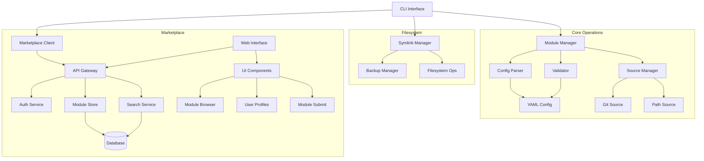

# dotkit 

[](LICENSE)
[](https://ziglang.org)
[](https://ziglang.org)

## Overview

A dotfiles configuration manager with a module based approach. The system supports multiple modules for each type of system component (bars, docks, file managers, terminals etc.) allowing for easy sharing of configurations between systems.

## Motivation

Let's be real - dotfiles are usually a beautiful mess.

Everyone does their own thing, which is awesome for making your setup uniquely yours...
but it can be a real pain when you want to:

- Share your configs with others
- Maintain them long-term
- Try out different setups

That's why I built Dotkit.

The idea is simple: have some structure, but don't box anyone in. Want to:

- Try out someone's cool terminal setup? Just grab their module.
- Test different status bar configs? Install as many as you want.
- Switch between setups? No conflicts, no stress.

Integrate dotkit as much or as little as you want to your workflow!

## Quick Start

### Prerequisites

- [Zig](https://ziglang.org/) 0.13.0 or later
- [Git](https://git-scm.com/)

### Build from Source

```bash
# Clone the repository
git clone https://github.com/richen604/dotkit.git
cd dotkit

# Build and run
zig build run
```

Nix users can use the flake or direnv to install the dependencies.

```bash
# Using direnv
direnv allow

# Using flake
nix-shell
```

## Comparison with Existing Tools

Dotkit is designed to be an *addition* to existing tools in the dotfile space like GNU Stow, Chezmoi, etc.

| Feature | Dotkit | GNU Stow | Chezmoi |
|---------|---------|----------|----------|
| Module-Based Organization | ✅ | ❌ | ❌ |
| Per-Module Versioning | ✅ | ❌ | ❌ |
| Component-Level Isolation | ✅ | ❌ | ⚠️ |
| Module Marketplace | ✅ | ❌ | ❌ |
| NixOS & Home-Manager Support | ✅ | ❌ | ❌ |

*⚠️ Partial support through templates but not component-focused*

## Core Components

### System Design



### Configuration Schema

YAML-based configuration files that define:

- Module metadata and dependencies
- File mappings and paths
- Installation hooks
- Source configurations

### Module Manager

Core operations:

- Module validation and loading
- Installation/removal
- Source management

### Symlink Manager

Filesystem operations:

- Symlink creation/removal
- Backup/restore
- Path validation
- Link monitoring

## Directory Structure

```
src/
├── main.zig                  # Application entry point
├── lib.zig                   # Re-exports public API
├── core/                     # Core functionality
│   ├── config.zig            # Re-exports config components
│   │   ├── parser.zig        # YAML config parsing
│   │   ├── schema.zig        # Config schema definitions
│   │   ├── loader.zig        # config loading/initialization
│   │   └── validator.zig     # Config validation
│   ├── source.zig            # Re-exports source components
│   │   ├── git.zig           # Git repository sources
│   │   ├── path.zig          # Local filesystem sources
│   │   └── validator.zig     # Source validation
│   └── cache.zig            # Cache management
├── fs.zig                    # Re-exports fs components
│   ├── manager.zig           # High-level fs operations
│   ├── backup.zig            # Config backup/restore
│   └── symlink.zig           # Symlink management
├── cli.zig                   # Re-exports CLI components
│   ├── commands.zig          # CLI command implementations
│   └── output.zig            # CLI output formatting
└── utils.zig                 # Re-exports utility functions
    ├── fs.zig                # Filesystem utilities
    ├── logger.zig            # Logging functionality
    └── error.zig             # Error handling
tests/                        # Test directory
├── core/                     # Core functionality tests
│   ├── config_test.zig       # Config tests
│   ├── module_test.zig       # Module tests
│   └── source_test.zig       # Source tests
├── fs_test.zig               # Filesystem tests
├── cli_test.zig              # CLI tests
└── utils_test.zig            # Utility tests
build.zig                     # Build configuration
build.zig.zon                 # Build dependencies
```

## Implementation Details

### Module Configuration Format

Each module configuration includes:

```toml
# Basic module metadata
name = "alacritty"
namespace = "johndoe" # namespaces are used to prevent conflicts
category = "terminal"
description = "A fast GPU-accelerated terminal emulator"

# metadata only, does not install dependencies
dependencies = [
    "alacritty",
    "fonts-firacode"
]

config_path = "~/.config/alacritty"

[[files]]
source = "./alacritty/alacritty.toml"
target = "~/.config/alacritty/alacritty.toml"

# folders can be symlinked as well
[[files]]
source = "./alacritty/scripts/**"
target = "~/.config/alacritty/scripts/"
executable = true # default is false

# some programs have daemons that need to be started
[[files]]
source = "./alacritty/alacritty.desktop"
target = "~/.config/autostart/alacritty.desktop"

[hooks]
start = [
    "./scripts/start-alacritty.sh" # start the program with command or custom script
]
pre_install = [
    "./scripts/install-deps.sh",
    "mkdir -p ~/.config/alacritty"
]
post_install = [
    "alacritty --version"
]
pre_remove = [
    "./scripts/uninstall-deps.sh"
]
```

### Global Configuration

```toml
name = "my-dotfiles" # optional name
namespace = "johndoe" # namespace is used to prevent conflicts
description = "My personal dotfiles for hyprland"
backup_path = "~/.local/state/dotkit/backup" # default

# Global hooks, runs before any module is installed
[hooks]

[[modules]]
name = "terminal"

# Path type (inferred)
[[modules.sources]]
location = "./alacritty"
enable = true

# Git type (inferred)
[[modules.sources]]
url = "https://github.com/my-alacritty-config.git"
branch = "main"
ref = "v1.0.0"
enable = false

# Module type (inferred)
[[modules.sources]]
[modules.sources.config]
name = "alacritty"
category = "terminal"

[[modules.sources.config.files]]
source = "./alacritty.toml"
target = "~/.config/alacritty/alacritty.toml"
```

### Example Configuration Directory

```
├── config.toml
├── scripts/
│   └── ... 
├── alacritty/
│   ├── themes/
│   │   └── ...
│   ├── screenshots/
│   │   └── ...
│   ├── install-deps.sh
│   └── config.toml
├── kitty/
│   ├── config.toml
│   └── kitty.conf
└── waybar/
    ├── config.toml
    ├── waybar.desktop
    └── waybar.conf
```

### State Management

Dotkit manages both static configurations and state files through explicit declarations:

1. **Static Configuration** - Static files
2. **State Files** - User-specific, mutable data

State files are an optional feature, but it is highly recommended regarding system design.
Dotfile configurations often hold dynamic state

```toml

# state is false by default
[[files]]
source = "./alacritty/alacritty.toml"
target = "~/.config/alacritty/alacritty.toml"

[[files]]
source = "./nvim/sessions"
target = "~/.local/share/nvim/sessions"
state = true   # marks as managed state directory
```

This approach:

- Makes state management explicit and intentional
- Provides controlled state file management
- Enables proper NixOS integration
- Simplifies configuration sharing
- Supports automated backup/restore workflows
- Allows for state file versioning when desired

## Command Line Interface

```bash
# Core Configuration Commands
dotkit init                      # Initialize a new dotkit configuration
dotkit list                      # List available modules
dotkit status                    # Show status of all configured modules

# Module Management
dotkit install [module]          # Install all modules or a single module
dotkit remove [module]           # Remove all modules or 
dotkit backup [module]           # Backup one or all module configs
dotkit restore [module]          # Restore one or all module configs

# Source Management
dotkit pull [module]           # Update/install git-based module sources or all git based modules

# Utility Commands
dotkit eject [module]            # ejects by converting symlinks to regular files
```

## Development Phases

### Phase 1: MVP Foundation (Week 1-2)

- [x] Basic project structure setup
- [x] Pretty cli output utilities
- [x] Basic CLI (install/remove/list)
- [x] Simple TOML config parser
- [x] Core symlink operations (create/remove)
- [x] Essential error handling
- [x] Unit test framework

### Phase 2: Core Features (Week 2-3)

- [ ] Core Manager Implementation
  - [ ] Config/Module shared functionality
  - [ ] Source handling (git/local)
  - [ ] Cache management
  - [ ] State tracking
- [ ] Filesystem Manager
  - [ ] Symlink operations
  - [ ] Backup/restore
  - [ ] Path resolution
- [ ] Validation Manager
  - [ ] Schema validation
  - [ ] Path validation
  - [ ] Source validation
  - [ ] Hook validation
- [ ] Integration tests
  - [ ] Manager integration tests
  - [ ] End-to-end workflow tests
  - [ ] Error handling tests

### Phase 4: Initial Content Creation (Week 3-4)

- [ ] Convert popular dotfile repositories to dotkit format
- [ ] Create documentation and examples for each converted module
- [ ] Establish module metadata standards and tagging system
- [ ] Quality assurance process for converted modules
- [ ] Create automated conversion tools where possible

### Phase 5: Marketplace Website (Week 4-5)

- [ ] Module marketplace frontend with search and filtering
- [ ] Module submission and review system
- [ ] User accounts and ratings
- [ ] Config sharing platform
- [ ] Module dependency visualization
- [ ] API endpoints for module/config discovery

### Phase 6: NixOS Integration (Week 6-7)

- [ ] Home-Manager module
- [ ] NixOS module
- [ ] Nix flake integration
- [ ] Integration tests for Nix features

### Phase 7: Polish & Release (Week 7-8)

- [ ] Documentation
- [ ] Error reporting improvements
- [ ] Bug fixes
- [ ] Performance optimization
- [ ] Security review
- [ ] Initial release

### Future Enhancements

Planned features:

- Developer mode (HMR), exit reverts
- Automated vm builder for extended development
- Profile support
- Cli publish commands
- Conflict resolution
- Modes (copy/symlink/install)

Unsure features:

- Generations similar to home-manager
- Interactive module configuration wizard
- Real-time config sync between multiple machines
