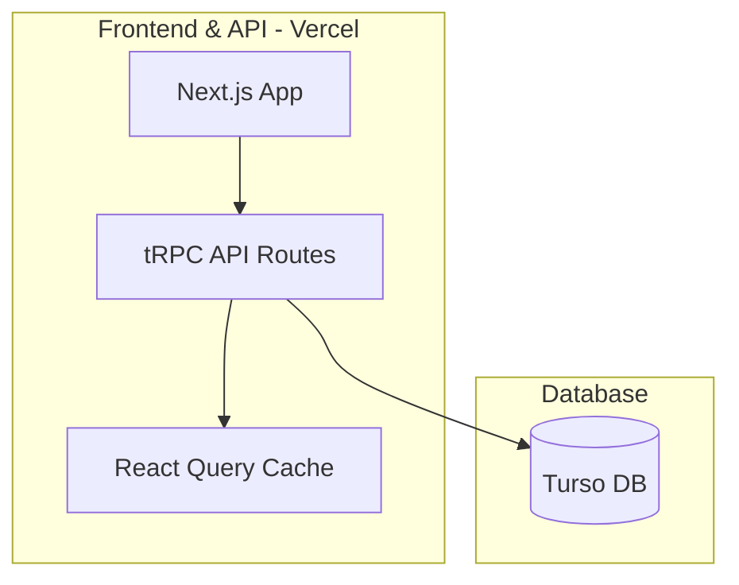

# Dotkit Marketplace Development Roadmap 🏪

## Tech Stack

- [Next.js](https://nextjs.org) - React framework
- [Drizzle](https://orm.drizzle.team) - TypeScript ORM
- [tRPC](https://trpc.io) - End-to-end typesafe APIs
- [Tailwind CSS](https://tailwindcss.com) - CSS framework
- [NextAuth.js](https://next-auth.js.org) - Authentication
- [TypeScript](https://www.typescriptlang.org) - Type safety

## Development Phases

### Phase 1: MVP Foundation
- [ ] Initialize T3 project with create-t3-app
- [ ] Set up Drizzle schema and migrations
  - Start with users and modules tables only
- [ ] Basic GitHub OAuth integration
- [ ] Minimal layout with navigation
- [ ] Simple Vercel deployment

### Phase 2: Essential Features
- [ ] Basic User Management
  - [ ] GitHub login
  - [ ] Simple profile page
- [ ] Core Module Management
  - [ ] Basic module submission form
  - [ ] Module listing page
  - [ ] Simple version tracking
- [ ] Basic Search
  - [ ] Text search
  - [ ] Simple category filter

### Phase 3: Community MVP
- [ ] Basic Engagement Features
  - [ ] Star modules
  - [ ] Simple comments
- [ ] Collections v1
  - [ ] Create personal collections
  - [ ] Add/remove modules

### Phase 4: Developer Experience
- [ ] Basic Documentation
  - [ ] Integration guide
  - [ ] API documentation
- [ ] Simple CLI Tool
  - [ ] Module installation
  - [ ] Basic publishing

## Database Schema

```typescript
// User schema
export const users = pgTable("users", {
  id: serial("id").primaryKey(),
  name: text("name"),
  email: text("email").unique(),
  image: text("image"),
  githubId: text("github_id").unique(),
  createdAt: timestamp("created_at").defaultNow(),
});

// Module schema
export const modules = pgTable("modules", {
  id: serial("id").primaryKey(),
  name: text("name").notNull(),
  namespace: text("namespace").notNull(),
  description: text("description"),
  authorId: integer("author_id").references(() => users.id),
  githubUrl: text("github_url"),
  category: text("category").notNull(),
  downloads: integer("downloads").default(0),
  stars: integer("stars").default(0),
  createdAt: timestamp("created_at").defaultNow(),
  updatedAt: timestamp("updated_at").defaultNow(),
});

// Reviews schema
export const reviews = pgTable("reviews", {
  id: serial("id").primaryKey(),
  moduleId: integer("module_id").references(() => modules.id),
  userId: integer("user_id").references(() => users.id),
  rating: integer("rating").notNull(),
  comment: text("comment"),
  createdAt: timestamp("created_at").defaultNow(),
});

// Collections schema
export const collections = pgTable("collections", {
  id: serial("id").primaryKey(),
  name: text("name").notNull(),
  description: text("description"),
  userId: integer("user_id").references(() => users.id),
  isPublic: boolean("is_public").default(true),
  createdAt: timestamp("created_at").defaultNow(),
});

// Collection items schema
export const collectionItems = pgTable("collection_items", {
  id: serial("id").primaryKey(),
  collectionId: integer("collection_id").references(() => collections.id),
  moduleId: integer("module_id").references(() => modules.id),
  addedAt: timestamp("added_at").defaultNow(),
});
```

## API Routes

### Module Management
```typescript
// Example tRPC router for modules
export const moduleRouter = createTRPCRouter({
  create: protectedProcedure
    .input(createModuleSchema)
    .mutation(async ({ ctx, input }) => {
      // Create new module
    }),
    
  getAll: publicProcedure
    .input(z.object({
      limit: z.number().min(1).max(100).default(10),
      cursor: z.number().nullish(),
    }))
    .query(async ({ ctx, input }) => {
      // Get paginated modules
    }),
    
  getById: publicProcedure
    .input(z.object({ id: z.number() }))
    .query(async ({ ctx, input }) => {
      // Get single module
    }),
});
```

## Frontend Components

### Core Components
- ModuleCard
- SearchBar
- FilterPanel
- UserProfile
- ModuleSubmissionForm
- ReviewComponent
- CollectionGrid

### Pages
- Home/Discovery
- Module Details
- User Profile
- Submit Module
- Collection View
- Search Results
- Documentation

## Architecture



### Next.js Configuration
```javascript
// next.config.js
module.exports = {
  // Default Next.js configuration
  reactStrictMode: true,
  swcMinify: true,
}
```

### Performance Optimizations (No Edge Functions)
- React Query for client-side caching
- Incremental Static Regeneration (ISR) for popular pages
- Debounced search with client-side filtering
- Optimistic UI updates
- Efficient pagination with cursor-based queries
- Background revalidation of static pages

### Rate Limiting Implementation

```typescript:src/server/api/trpc.ts
import { Redis } from '@upstash/redis'
import { Ratelimit } from '@upstash/ratelimit'

const redis = new Redis({
  url: process.env.UPSTASH_REDIS_URL,
  token: process.env.UPSTASH_REDIS_TOKEN,
})

const ratelimit = new Ratelimit({
  redis,
  limiter: Ratelimit.slidingWindow(100, '15 m'),
  analytics: true,
})

const withRateLimit = t.middleware(async ({ ctx, next }) => {
  const identifier = ctx.session?.user?.id || 
    ctx.req.headers['x-forwarded-for'] || 
    'anonymous'
    
  const { success, limit, remaining } = await ratelimit.limit(identifier.toString())

  if (!success) {
    throw new TRPCError({
      code: 'TOO_MANY_REQUESTS',
      message: `Rate limit exceeded. ${remaining} requests remaining. Try again in 15 minutes.`,
    })
  }
  
  return next()
})
```

## Deployment

### Infrastructure
- Vercel
  - Next.js hosting
  - API routes
  - Edge functions (when needed)
  - Automatic CI/CD
  - Built-in monitoring

- Database
  - Turso distributed SQLite
  - Edge-hosted replicas
  - Automatic backups

- Caching (Optional)
  - Upstash Redis
  - Vercel KV

### Monitoring & Operations

- Application Monitoring
  - Vercel Analytics
  - Error tracking
  - Performance monitoring
  - Deployment logs

- Database Monitoring
  - Turso dashboard
  - Query performance
  - Storage metrics

- Backup Strategy
  - Daily Turso backups
  - Configuration backups
  - Automated restore testing

### Cost Breakdown By Scale

#### 0-5,000 Users/Month
- Infrastructure
  - Vercel: Free tier
    - Includes hosting, functions, and analytics
  - Turso: Free tier
    - Metadata storage only (25M rows/month)
  - Upstash Redis: Free tier (optional)
Total: $0/month

#### 5,000-20,000 Users/Month
- Infrastructure
  - Vercel: Pro tier ($20/month)
    - Required for increased usage
  - Turso: Free tier (still within limits)
  - Upstash Redis: Pro tier ($25/month, if needed)
Total: $20-45/month

#### 20,000-100,000 Users/Month
- Infrastructure
  - Vercel: Pro tier ($40/month)
  - Turso: Pro tier ($29/month)
    - Required for increased row limits
  - Upstash Redis: Business tier ($50/month, if needed)
Total: $69-119/month

## Future Enhancements

### Phase 5: Advanced Features
- [ ] Module dependency visualization
- [ ] Automated testing integration
- [ ] Module compatibility checking
- [ ] Advanced search with Algolia
- [ ] Real-time notifications
- [ ] Module update webhooks

### Phase 6: Enterprise Features
- [ ] Team accounts
- [ ] Private modules
- [ ] Custom branding
- [ ] Analytics dashboard
- [ ] API rate limiting
- [ ] SLA guarantees
